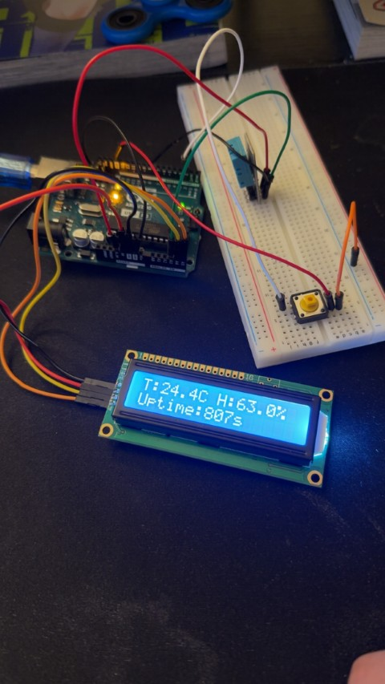

# Arduino---Projects
Personal Arduino Uno 3 Projects 

### Arduino Uno Smart Car Build : June 2025 

**Description:**  
This project implements the code for an IR-controlled robotic vehicle capable of multiple modes of operation, such as line tracking, obstacle avoidance, hand guided navigation, and remote-controlled movement. The vehicle uses various sensors and actuators to achieve autonomous and manual control.

**Components Used:**
- Arduino Uno R3
- Motor Driver Module (L9110 )
- IR Receiver (compatible with the IRremote library)
- IR Remote Control (
- Ultrasonic Sensor (HC-SR04)
- Line Tracking Module
- IR Obstacle Sensors (2 sensors for left and right detection)
- DC Motors (2 or 4, depending on your vehicle design
- Universal Wheel 
- Power Source (9v battery)
- Breadboard
- Jumper Wires
- Chassis (for assembling the vehicle)

**Features:**
- Remote Control: Operate the robot using an IR remote with predefined key mappings for movements and mode selection.
- Line Tracking: Follows a line using a line-tracking module.(Automated)
- Auto Drive/Obstacle Avoidance: The car will drive fully automated avoiding obstacles using the infrared sensors and ultrasonic sensor.
- Object Following: Follows nearby objects using ultrasonic sensors for distance measurement and infrared sensors for precise turning mechanisms.
- Customizable Speed: Increase or decrease speed using the remote.

**Setup & Execution:**
- Assemble the car using the chosen chassis and peripherals in an optimal configuration. Refer to the provided pinout diagram or a similar guide for wiring instructions.
- Run the sketch_smartcar.ino file found above in the arduino IDE.
- Videos of functionality above.

0 (0x16): Reset button, will stop all movements 
1 (0xC): Move left forward.
2 (0x18): Move forward.
3 (0x5E): Move right forward.
4 (0x8): Turn left.
5 (0x1C): Reserved for potential functionality 
6 (0x5A): Turn right.
7 (0x42): Backward-left movement.
8 (0x52): Move backward.
9 (0x4A): Backward-right movement.
+ (0x9): Increase motor speed by 25 units.
- (0x15): Decrease motor speed by 25 units.
EQ (0x7): Activates the following mode
U/SD (0xD): Activates the autonomous driving mode
CYCLE (0x19): Activates line-tracking mode.
FORWARD (0x43): Activates ultrasonic obstacle avoidance mode.
BACKWARD (0x40): Activates IR obstacle avoidance mode.
Note: Auto Drive is the fully functioning mode, while the IR/ultrasonic obstacle avoidance modes are sub functions required to run Auto Drive. 

### Temperature and Humidity Display with Unit Toggle & Graphing : May 2025 

**Components Used:**
- Arduino Uno R3  
- DHT11 Temperature & Humidity Sensor  
- LCD Display with I2C Module (16x2)  
- Pushbutton  
- Breadboard  
- Jumper Wires  

**Description:**  
This project reads real-time temperature and humidity data using the DHT11 sensor and displays it on a 16x2 LCD via I2C. A single pushbutton allows the user to toggle between Celsius and Fahrenheit readings and a Bar graph. The display also shows system uptime in seconds. Required code above!

**Features:**
- Real-time measurement of temperature and humidity  
- Toggle between °C and °F using a single button  
- Multiple display modes (data view, graph)  
- Simple bar-graph visualization on LCD  
- Uptime display (in seconds)  
- Reliable button handling with software debouncing  

